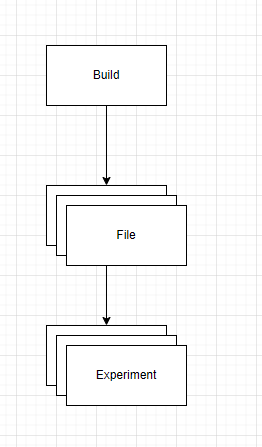

# Project Structure

This document attempts to outline how the runtime works, and how data is linked.

As a brief overview, a `Build` will contain a list of `File`s which individually contain a lsit of `Experiment`s.

This somewhat odd layout allows for better de-duplication. Any builds that share identical files, will also share identical experiments.

Unsure whether to give experiments a unique ID / their own db table so that we can do experiment tracking as experiments get modified?
